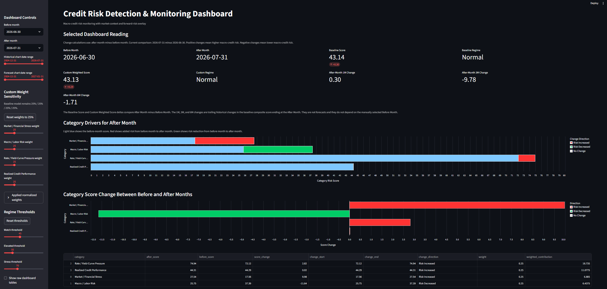
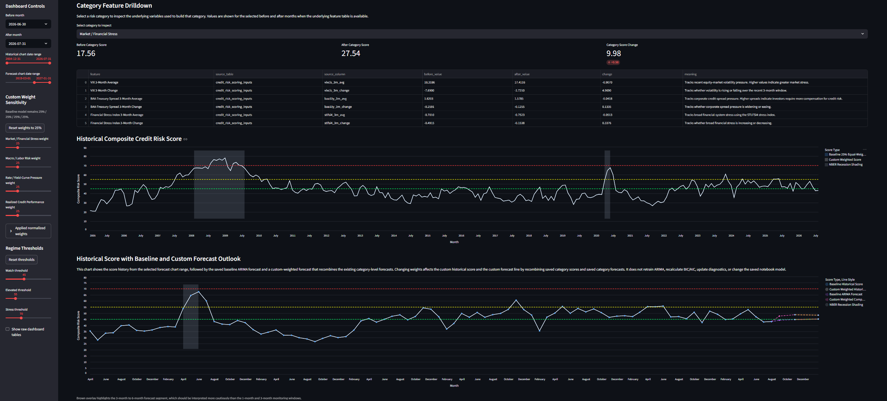
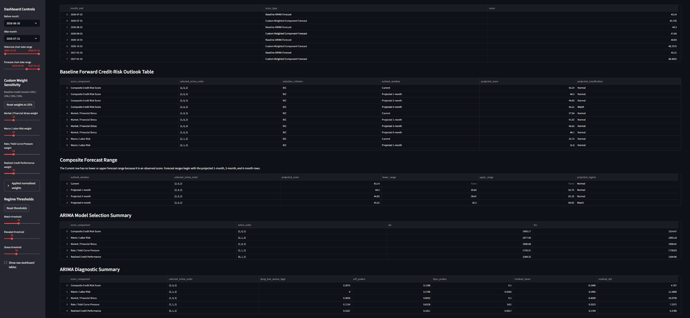
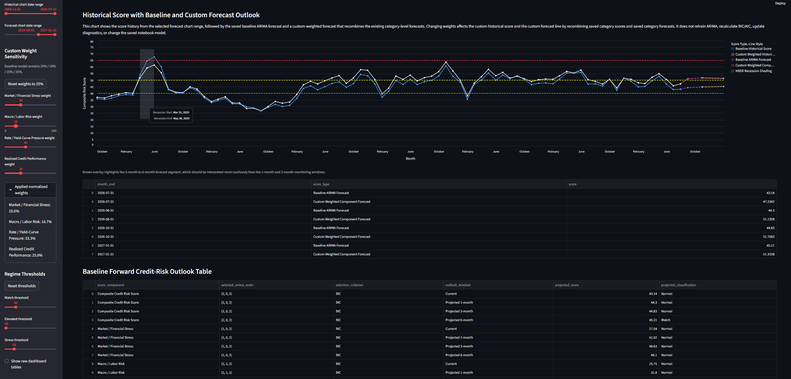

# Credit Risk Detection & Monitoring Dashboard

This project builds a reproducible macro-credit risk monitoring dashboard using Python, SQLite, Streamlit, and public FRED data. The dashboard combines macroeconomic, interest-rate, market-volatility, financial-stress, credit-spread, delinquency, charge-off, and recession indicators into a monthly credit-risk scoring framework.

The final output is an interactive Streamlit dashboard that summarizes current macro-credit conditions, tracks risk-channel drivers, compares before-and-after monthly changes, displays historical risk regimes, provides a baseline ARIMA forward-risk outlook, and includes sensitivity controls for category weights and regime thresholds.

## Project Objective

The project is designed to answer the following questions:

1. Are aggregate macro-credit conditions currently Normal, Watch, Elevated, or Stress?
2. Which risk channels are driving the current credit-risk score?
3. Are conditions improving, stabilizing, or deteriorating across 1-month, 3-month, and 6-month windows?
4. Is current risk broad-based across multiple channels or concentrated in one channel?
5. Did the score behave sensibly around historical recession and stress periods?
6. Do higher-risk regimes or regime transitions provide useful context for future S&P 500 returns?
7. What does the baseline forward outlook imply for near-term monitoring?

## Dashboard Screenshots
Click any screenshot to open the full-resolution image.

### Dashboard Overview and Category Drivers

[](assets/crd_shot1.png)

### Feature Drilldown, Historical Score

[](assets/crd_shot2.png)

### Forecast and Tables

[](assets/crd_shot3.png)

### Model Diagnostics and ARIMA Interpretation

[](assets/crd_shot4.png)

## Methods Used

- FRED API data retrieval
- Python data cleaning and feature engineering
- SQLite database storage
- Monthly frequency alignment
- Expanding percentile risk scoring
- Category-level credit-risk scoring
- Composite risk-score construction
- Revised regime thresholds
- ARIMA baseline forecasting
- Forecast diagnostic checks
- Local Streamlit dashboard
- Interactive weight and threshold sensitivity analysis

## Risk Categories and Input Variables

The composite score is built from four macro-credit risk channels. Each input is transformed into a comparable risk signal and then converted into expanding percentile scores to avoid lookahead bias.

1. **Market / Financial Stress**
   - VIX 3-month average
   - VIX 3-month change
   - BAA-Treasury spread 3-month average
   - BAA-Treasury spread 3-month change
   - STLFSI4 financial stress index 3-month average
   - STLFSI4 financial stress index 3-month change

2. **Macro / Labor Risk**
   - Unemployment rate 3-month average
   - Unemployment rate 3-month change

3. **Rate / Yield-Curve Pressure**
   - 30-year Treasury yield 3-month average
   - 30-year Treasury yield 3-month change
   - Yield-curve inversion risk

4. **Realized Credit Performance**
   - All-loan delinquency rate
   - All-loan delinquency rate 3-month change
   - All-loan charge-off rate
   - All-loan charge-off rate 3-month change

The baseline model uses equal 25% category weights for transparency. The Streamlit dashboard allows users to test custom category-weight assumptions without changing the saved baseline model.

## Dashboard Features
The `streamlit_app/app.py` file contains the Streamlit dashboard code. It reads the cleaned SQLite database, loads the saved dashboard tables, builds the interactive charts, and powers the weight/threshold sensitivity controls.

The Streamlit dashboard includes:

- Latest composite credit-risk score and regime
- Before/after month comparison
- 1-month, 3-month, and 6-month trailing score changes
- Category-driver comparison chart
- Category score-change chart
- Feature drilldown by risk category
- Historical composite score with recession shading
- Custom-weight sensitivity layer
- Adjustable regime thresholds
- Baseline ARIMA forecast outlook
- Custom-weighted forecast recombination
- ARIMA model selection and diagnostics

## Forecast and Sensitivity Interpretation

The dashboard includes two forward-looking forecast views:

1. **Baseline ARIMA Forecast**
2. **Custom Weighted Component Forecast**

The **Baseline ARIMA Forecast** is the official saved forecast from the notebook. It is produced by fitting an ARIMA model directly to the final Composite Credit Risk Score. In other words, the baseline model first uses the already-created composite score series, then forecasts that composite score as one time series.

The **Custom Weighted Component Forecast** is a sensitivity layer. It does not refit ARIMA. Instead, it takes the separately saved category-level forecasts and recombines them using the current category weights selected in the Streamlit sidebar.

Conceptually, the two approaches differ:

```text
Baseline ARIMA Forecast:
Composite Credit Risk Score -> ARIMA model -> projected composite score

Custom Weighted Component Forecast:
Category forecasts -> custom category weights -> recombined projected score
```

Because these are different forecasting methods, the two forecast lines can differ even when the custom weights are set to 25% each. Forecasting the already-averaged composite score is not necessarily the same as forecasting each category separately and then averaging the category forecasts. Each category has its own historical pattern, ARIMA order, persistence, volatility, and residual behavior.

The custom-weight controls affect the custom historical score and the custom weighted forecast line. They do not change the saved baseline ARIMA forecast, selected ARIMA orders, AIC/BIC values, diagnostic statistics, or SQLite model outputs. The custom-weight layer should therefore be interpreted as a scenario and sensitivity tool, not as a full model retraining system.

The threshold sliders adjust how score levels are classified into Normal, Watch, Elevated, and Stress regimes. Changing thresholds can alter regime labels and visual interpretation, but it does not change the underlying score values or the saved forecast model.

## Key Interpretation

The latest dashboard output classifies macro-credit conditions as **Normal**, but close to the Watch threshold. The most elevated category is Rate / Yield-Curve Pressure, while Market / Financial Stress and Macro / Labor Risk show meaningful recent movement. Realized Credit Performance remains slower-moving, consistent with delinquency and charge-off indicators being lagging credit-performance measures.

The ARIMA forecast is treated as a transparent baseline monitoring layer, not a precision forecasting engine. Model diagnostics show that some category-level forecasts, especially Macro / Labor Risk, require cautious interpretation due to residual autocorrelation and stationarity concerns.

## How to Run Locally

Clone or download the repository and navigate to this project folder.

Install dependencies:

```bash
pip install -r requirements.txt
```

Run the Streamlit dashboard:

```bash
python -m streamlit run streamlit_app/app.py
```

The app reads from the included SQLite database:

```text
data/cleaned/credit_risk_detection_monitoring.db
```

## Environment Variables

The original data pipeline used a FRED API key stored locally in a `.env` file.

A real API key is **not included** in this repository.

Use `.env.example` as a template:

```text
FRED_API_KEY=your_fred_api_key_here
```

The included Streamlit dashboard runs from the cleaned SQLite database and does not require the API key for dashboard viewing.

## Repository Structure

```text
01_credit_risk_detection_monitoring_dashboard/
│
├── README.md
├── requirements.txt
├── .gitignore
├── .env.example
├── streamlit_app/
│   └── app.py
├── data/
│   └── cleaned/
│       └── credit_risk_detection_monitoring.db
└── assets/
    ├── crd_shot1.png
    ├── crd_shot2.png
    ├── crd_shot3.png
    └── crd_shot4.png
```

The final public version focuses on the Streamlit dashboard, cleaned SQLite database, screenshots, and project documentation. The full development notebook is excluded from this initial upload to avoid exposing local paths, notebook checkpoints, or development artifacts.

## Limitations

- The ARIMA layer is a baseline monitoring forecast, not a fully validated production forecast.
- Some category-level diagnostics are mixed, especially Macro / Labor Risk.
- The Streamlit custom-weight forecast recombines saved category forecasts but does not retrain ARIMA live.
- The baseline composite forecast and custom weighted component forecast can differ even at equal weights because they are produced through different forecasting workflows.
- The S&P 500 market-context analysis is exploratory and not sufficient for standalone trading decisions.
- Quarterly credit-performance variables are forward-filled to monthly frequency, which makes them slower-moving than market-based indicators.

## Version 2 Enhancements

Future improvements could include:

- Rolling-origin forecast validation for 1-month, 3-month, and 6-month horizons
- Benchmark comparison against naive, moving-average, and random-walk models
- Stationarity testing and transformation workflow before model fitting
- ARIMAX / SARIMAX models using inflation, policy-rate, lending-standard, and credit-supply variables
- Alternative empirical category-weighting schemes
- Forecast interval coverage validation
- Regime-probability forecasting
- Scenario saving inside the Streamlit dashboard
- Expanded market-context validation using additional risk assets

## Reproducibility Note

This public version is designed to reproduce the finished Streamlit dashboard, not the full raw API ingestion pipeline.

The dashboard runs from the included SQLite database:

```text
data/cleaned/credit_risk_detection_monitoring.db
